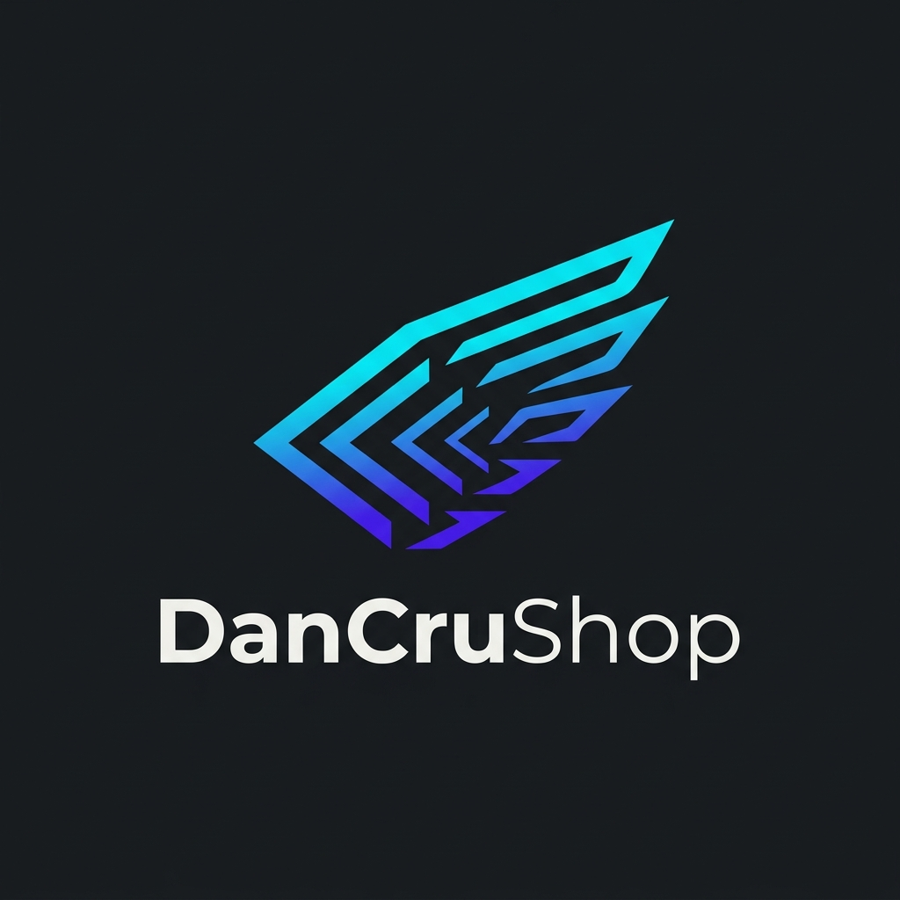

# Bản thiết kế chuẩn UI/UX — DanCruShop

Tài liệu này cung cấp sơ đồ thiết kế (Design Blueprint) và các quy chuẩn UI/UX cho website **DanCruShop** nhằm xây dựng một giao diện nhất quán, chuyên nghiệp và tối ưu tỷ lệ chuyển đổi cho sản phẩm số.

---

## 1. Bản vẽ thiết kế mẫu (Design Mockup Options)

Dưới đây là hai phương án thiết kế giao diện mẫu dành cho trang chủ sản phẩm số để bạn đối chiếu. Các tệp ảnh mẫu đã được lưu trong thư mục `public/` của dự án:

### Phương án A: Premium Dark Theme (Tối sang trọng)

---

### Phương án B: Minimalist Light Theme (Sáng thanh lịch)

---

## 2. Hệ thống thiết kế đề xuất (Design System)

### 2.1 Bảng màu (Color Palette Options)
Bạn có thể lựa chọn 1 trong 2 bảng màu chuẩn để tối ưu hóa trải nghiệm trực quan:

#### Phương án A: Premium Dark Theme
- **Nền chính (Primary Background):** `#090A0F` (Tối sâu, dịu mắt).
- **Nền thẻ & Panel (Card Background):** `#161720` kết hợp `backdrop-filter: blur(16px)` và viền mờ `rgba(255, 255, 255, 0.08)`.
- **Màu điểm nhấn chính (Primary Accent):** `#3B82F6` (Electric Blue) hoặc `#6366F1` (Indigo).
- **Màu chữ chính:** `#F9FAFB` (Trắng ấm), **Màu chữ phụ:** `#9CA3AF` (Xám dịu).

#### Phương án B: Minimalist Light Theme
- **Nền chính (Primary Background):** `#F8FAFC` (Slate nhạt, tạo cảm giác sạch sẽ, thoáng đãng).
- **Nền thẻ & Panel (Card Background):** `#FFFFFF` với bóng đổ cực mềm (`box-shadow: 0 4px 20px -2px rgba(0, 0, 0, 0.05)`) và viền mỏng `#E2E8F0`.
- **Màu điểm nhấn chính (Primary Accent):** `#0EA5E9` (Sky Blue) hoặc `#0D9488` (Teal).
- **Màu chữ chính:** `#0F172A` (Slate tối), **Màu chữ phụ:** `#64748B` (Xám Slate nhẹ).

### 2.2 Kiểu chữ (Typography)
- **Font gia đình:** Ưu tiên **Inter** hoặc **Geist Sans** (Fonts tối ưu cho hiển thị màn hình số, lập trình và giao diện hiện đại).
- **Tiêu đề lớn (Hero Title):** Kích thước `3xl` đến `5xl`, `font-weight: 700`, khoảng cách chữ hơi thu hẹp (`tracking-tight`) để tiêu đề trông gãy gọn và thu hút.
- **Nội dung thẻ:** Kích thước `sm` hoặc `base` (`14px` - `16px`), `font-weight: 500` hoặc `600` cho tên sản phẩm.

### 2.3 Ý tưởng thiết kế Logo (Logo Concept Options)

#### Phương án 1: Ý tưởng D-Cart-Code (Nguyên bản của DanCru)
Sự kết hợp giữa chữ cái viết tắt **"D"** (DanCru), biểu tượng chiếc xe đẩy hàng (Shop) và ký tự lập trình **`</>`** đại diện cho sản phẩm số.

#### Phương án 2: Ý tưởng "The Dev Box" (Hộp đóng gói tài nguyên)
Khối hộp 3D Isometric đại diện cho gói hàng (package) lập trình, với các ký tự code phát sáng bay lên, tượng trưng cho sản phẩm số đóng gói sẵn dùng ngay.

#### Phương án 3: Ý tưởng "Speed Ship Rocket" (Tên lửa tăng tốc lập trình)
Hai dấu ngoặc nhọn `<` và `>` cách điệu thành cánh tên lửa phóng lên, với lõi năng lượng phát sáng ở giữa, đại diện cho tinh thần tối ưu tốc độ ("ship nhanh hơn").

#### Phương án 4: Ý tưởng "Flat Geometric" (Tối giản hình học phẳng)
Sử dụng các hình khối hình học phẳng siêu giản lược (không uốn lượn phức tạp, không hiệu ứng 3D/neon chói mắt). Logo tập trung vào tính biểu tượng thuần túy, dễ nhận diện khi thu nhỏ xuống dạng favicon `16x16` hoặc icon app.

#### Phương án 5: Ý tưởng "Play-Code Button" (Nút Play tích hợp mã nguồn)
Lấy cảm hứng từ nút **Play** đặc trưng của YouTube hay logo của Google Play, nhưng biểu tượng bên trong được tạo tác từ dấu ngoặc nhọn `<` và dấu gạch chéo `/`. Nó thể hiện sự kết hợp giữa việc "chạy/kích hoạt" (Play) sản phẩm lập trình, khóa học video và các tài nguyên số có thể khởi chạy tức thì.

#### Phương án 6: Ý tưởng "Cyber-Wing Bracket" (Cánh chim công nghệ lướt sóng)
Một biểu tượng hoàn toàn nguyên bản, cách điệu từ hình dáng một chiếc cánh chim (hoặc chim ưng) đang lao vút về phía trước đại diện cho tốc độ ("ship nhanh hơn"). Toàn bộ phần lông cánh được ghép lại từ các dấu ngoặc nhọn `<` lồng ghép chồng lên nhau theo lớp. Đây là thiết kế độc bản, hiện đại, mang ngôn ngữ lập trình sâu sắc và mang tính nhận diện rất cao.

---

## 3. Quy chuẩn cấu trúc các phần tử UI

### 3.1 Thẻ sản phẩm (Product Card)
Một thẻ sản phẩm số tiêu chuẩn cần được thiết kế có chiều sâu thay vì phẳng dẹt:
- **Hình thu nhỏ (Thumbnail):** Tỷ lệ chuẩn `16:9` hoặc `4:3`. Nên thiết kế một template ảnh bìa đồng bộ (ví dụ: nền tối + logo công nghệ đại diện ở giữa). Tránh để trống hoặc sử dụng ảnh chụp thực tế không liên quan.
- **Hệ thống Tags công nghệ:** Đặt ngay dưới ảnh các icon công nghệ nhỏ (React, Next.js, Laravel) để khách hàng nhận biết tech stack chỉ trong 0.5 giây.
- **Giá tiền:** Đặt ở vị trí nổi bật (dưới cùng bên trái hoặc góc trên bên phải), cỡ chữ to hơn mô tả ngắn.
- **Nút hành động (CTA):** Nút "Xem chi tiết" hoặc "Mua ngay" dạng viền mảnh (`outline`) hoặc bo tròn góc (`rounded-xl`).

### 3.2 Lưới Bento (Bento Grid / Banner Grid)
Để lưới Bento hoạt động chuẩn và không bị trống trải:
- Luôn giới hạn số lượng ảnh quảng cáo chia hết cho số cột hiển thị.
- **Quy tắc xếp:** 
  - Nếu có 4 ảnh: 1 ảnh lớn (`col-span-2 row-span-2`), 3 ảnh nhỏ.
  - Nếu chỉ có 2 ảnh: Chuyển lưới về dạng 2 cột bằng nhau (`grid-cols-2`), không dùng thuộc tính chiếm cột rộng để tránh tạo khoảng trống thừa ở Desktop.

---

## 4. Các nguyên lý trải nghiệm người dùng (UX Best Practices)

### 4.1 Quy tắc Nhất quán dữ liệu (Data Consistency)
- **Một loại tiền tệ duy nhất:** Trên giao diện hiển thị, nếu chọn hiển thị cho người Việt thì dùng **VND** (định dạng `1.000.000 đ`), nếu chọn toàn cầu thì dùng **USD** (định dạng `$20.00`). Việc để cả hai đơn vị trên cùng một trang chủ làm người mua nghi ngờ về tính nhất quán của hệ thống thanh toán.
- **Chuẩn hóa ngôn ngữ:** Không trộn từ ngữ kiểu "1.2k downloads và 5 đánh giá". Hãy dùng cấu trúc thuần Việt hoặc thuần Anh:
  - *Tiếng Việt:* "1.200 lượt tải • 5 đánh giá"
  - *Tiếng Anh:* "1.2k downloads • 5 reviews"

### 4.2 Tối ưu hóa phản hồi tâm lý (Psychological Feedback)
- **Đừng hiển thị điểm tệ cho sản phẩm mới:** Khi sản phẩm chưa được đánh giá, thay vì hiển thị `⭐ 0.0`, hãy ẩn hẳn cụm sao hoặc thay thế bằng nhãn `"Mới ra mắt"` hoặc `"Chưa có đánh giá"`. Điểm số `0.0` kích thích tâm lý e ngại của khách hàng.
- **Giao dịch an toàn (Trust Signals):** Đặt các huy hiệu bảo mật giao dịch (ví dụ: *Secure checkout by Lemon Squeezy*, *Giao dịch an toàn*) ở khu vực footer hoặc gần nút thanh toán để củng cố lòng tin.

### 4.3 Tự động hóa trải nghiệm (Smooth UX Flow)
- **Liên kết neo hoạt động chuẩn:** Đảm bảo tất cả các nút điều hướng danh mục trên thanh menu đầu trang và chân trang tự động cuộn mượt mà (`scroll-behavior: smooth`) đến đúng vị trí của phần danh mục bằng cách đặt `id="danh-muc"` đồng bộ.
